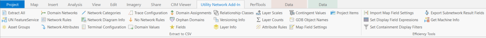

# utility-network-properties-extractor 

For use with ArcGIS Pro 3.1

This repository contains the source code for the 'Utility Network Property Extractor' ArcGIS Pro Add-in.  Single click buttons will create CSV files for the ArcGIS Utility Network, Geodatabase and Map properties.  There are also 6 efficiency tools to help set up your map and get your machine info.  

The Add-in works against layers from feature services, database connections and file geodatabases. Buttons are enabled/disabled based on the layers in the map.  

The Add-in is domain network agnostic.  It doesn’t matter if the industry is Electric, Gas, Communications, District Heating & Cooling, Water, Sewer, or others.

<!-- TODO: Fill this section below with metadata about this sample-->
```
Language:              C#
Subject:               Utility Network
Author:                Mike Hirschheimer <mhirschheimer@esri.com>
Organization:          Esri, http://www.esri.com
Date:                  2/23/2023
ArcGIS Pro:            3.1
Visual Studio:         2022
.NET Target Framework: .NET 6
```


## ArcGIS Pro Add-In
  
      
### 1.  Single click buttons that extract Utility Network, Geodatabase and Map properties to CSV files
* **Utility Network**:   UN FeatureService, Asset Groups, Domain Networks, Network Rules, Network Attributes, Network Categories, Network Diagram Info, Terminal Configuration, Trace Configuration, No Network Rules
* **Geodatabase**:  Domain Values, Domain Assignments, Orphan Domains, Fields, Relationship Classes, Versioning Info, Attribute Rules, Contingent Values, GDB Object Names
* **Map**:  Layer Info, Layer Scales, Layer Counts, Symbol Scales, Map Field Settings, Pop-up Fields

* **CSV file(s)** are written to folder c:\temp\ProSDK_CSV\Pro Project Name\
                        
### 2.  Efficiency tools to help with map configuration.

####   Set Display Field Expressions
- For Utility Network layers, sets the primary display field to the following:
  - Domain/Structure layers:  Asset Type and Objectid
  - Subnetline layer:  Subnetwork Name
  - Dirty Areas layer:  Objectid

####   Set Containment Display Filters
* Creates a new Display Filter used by containment for Utility Network layers with an assocationstatus field
* Name: DisplayContent          
* Sql:  associationstatus not in (4,5,6,12,13,14,36,37,38,44,45,46)

####   Import Map Field Settings
* Using a CSV from a “Map Field Settings” extraction, field settings can be modified and applied to the active map.
* Map Field Settings that can be changed:  Visibility, Read-Only, Highlighted and Field Alias

_Directions_
 1.  Open any map
 2.  Generate a CSV by clicking the Map Field Settings button
 3.  Open the CSV in Excel and edit the necessary Field Order, Visibility, Read-Only, Highlighted and Field Alias settings
 4.  Once done, make sure to save the file in CSV format and then close the file
 5.  In Pro, click on the 'Import Map Field Settings' button
 6.  Choose the CSV file to import
 7.  Once prompted that the import is complete, review the changes in either the 'Fields' pane or selecting features and viewing in the 'Attributes' pane 
 8.  You MUST save the Pro project for settings to persist

####   Import Popup Field Settings
* Using a CSV from a “Pop-up Fields” extraction, the Pop-up field visibility and order can be modified and applied to the active map

_Directions_
 1.  Open any map
 2.  Generate a CSV by clicking the Pop-up Fields button
 3.  Open the CSV in Excel and edit the necessary Pop-up Order and/or Visibility settings
 4.  Once done, make sure to save the file in CSV format and then close the file
 5.  In Pro, click on the 'Import Pop-up Field Settings' button
 6.  Choose the CSV file to import
 7.  Once prompted that the import is complete, review the changes in either the 'Configure Pop-ups' pane or identify a feature to open the Pop-up
 8.  You MUST save the Pro project for settings to persist

## Third party assemblies
1.  Newtonsoft.JSON v13.0.2
2.  Microsoft.Windows.Compatibility v7.0.3

## Compilation Directions
1.  Download the source code
2.  In Visual studio .NET compile the solution
3.  **The source code was written against ArcGIS Pro SDK 3.1 and it won't compile cleanly against a 2.x version.  Please switch to the 2.9 branch to get the latest code for that release.
4.  Start up ArcGIS Pro
5.  Open a project and confirm that the "Utility Network Add-in" toolbar is present

## ArcGIS Pro SDK Resources
* [ArcGIS Pro SDK for Microsoft .NET](https://pro.arcgis.com/en/pro-app/latest/sdk/)

* [ProConcepts Migrating to ArcGIS Pro](https://github.com/esri/arcgis-pro-sdk/wiki/ProConcepts-Migrating-to-ArcGIS-Pro)

* [ProConcepts Utility Network](https://github.com/esri/arcgis-pro-sdk/wiki/ProConcepts-Utility-Network)

* [Pro SDK Community Samples](https://github.com/esri/arcgis-pro-sdk-community-samples)

## Issues
Find a bug or want to request a new feature?  Please let us know by submitting an issue.

## Contributing
Esri welcomes contributions from anyone and everyone. Please see our [guidelines for contributing](https://github.com/esri/contributing).

## Licensing
Copyright 2021 Esri

Licensed under the Apache License, Version 2.0 (the "License");
you may not use this file except in compliance with the License.
You may obtain a copy of the License at

   http://www.apache.org/licenses/LICENSE-2.0

Unless required by applicable law or agreed to in writing, software
distributed under the License is distributed on an "AS IS" BASIS,
WITHOUT WARRANTIES OR CONDITIONS OF ANY KIND, either express or implied.
See the License for the specific language governing permissions and
limitations under the License.

A copy of the license is available in the repository's [license.txt]( https://raw.github.com/Esri/quickstart-map-js/master/license.txt) file.
